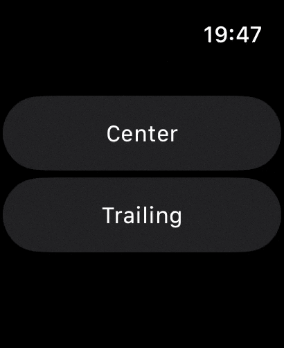

# CenteredClock

watchOS 10 Private API - Set the status bar in center placement



## Using lldb

```
(lldb) breakpoint set -n '-[PUICMutableApplicationSceneClientSettings setStatusBarPlacement:]' -G1 -C 'register write x2 0x1'
```
